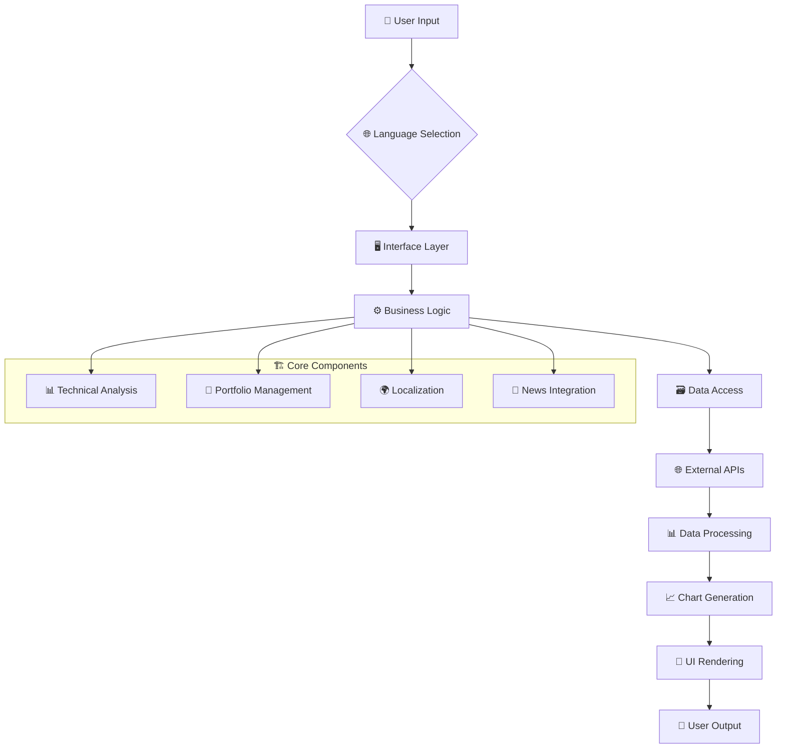

# 📈 DATASYNC Market Tool v2.0.0

<div align="center">

<!-- Language Selector -->
<div id="language-selector">
  <a href="#pt" onclick="setLanguage('pt')">
    
  </a>
  <a href="#en" onclick="setLanguage('en')">
    
  </a>
  <a href="#es" onclick="setLanguage('es')">
    
  </a>
</div>

<!-- Main Banner SVG -->
<svg width="800" height="400" viewBox="0 0 800 400" xmlns="http://www.w3.org/2000/svg">
  <!-- Background Gradient -->
  <defs>
    <linearGradient id="bgGradient" x1="0%" y1="0%" x2="100%" y2="100%">
      <stop offset="0%" style="stop-color:#1e3c72;stop-opacity:1" />
      <stop offset="100%" style="stop-color:#2a5298;stop-opacity:1" />
    </linearGradient>
    <linearGradient id="chartGradient" x1="0%" y1="0%" x2="100%" y2="0%">
      <stop offset="0%" style="stop-color:#00ff88;stop-opacity:0.8" />
      <stop offset="50%" style="stop-color:#00d4ff;stop-opacity:0.6" />
      <stop offset="100%" style="stop-color:#ff6b6b;stop-opacity:0.8" />
    </linearGradient>
  </defs>
  
  <!-- Background -->
  <rect width="800" height="400" fill="url(#bgGradient)" rx="15"/>
  
  <!-- Grid Pattern -->
  <pattern id="grid" width="40" height="40" patternUnits="userSpaceOnUse">
    <path d="M 40 0 L 0 0 0 40" fill="none" stroke="rgba(255,255,255,0.1)" stroke-width="1"/>
  </pattern>
  <rect width="800" height="400" fill="url(#grid)"/>
  
  <!-- Chart Background -->
  <rect x="50" y="50" width="700" height="300" fill="rgba(0,0,0,0.2)" rx="10"/>
  
  <!-- Animated Chart Line -->
  <path d="M 70 250 Q 150 180 230 220 T 390 160 T 550 200 T 730 140" 
        stroke="url(#chartGradient)" 
        stroke-width="4" 
        fill="none"
        stroke-dasharray="10,5">
    <animate attributeName="stroke-dashoffset" values="0;-15;0" dur="2s" repeatCount="indefinite"/>
  </path>
  
  <!-- Data Points -->
  <circle cx="70" cy="250" r="6" fill="#00ff88">
    <animate attributeName="r" values="6;8;6" dur="2s" repeatCount="indefinite"/>
  </circle>
  <circle cx="230" cy="220" r="6" fill="#00d4ff">
    <animate attributeName="r" values="6;8;6" dur="2s" begin="0.5s" repeatCount="indefinite"/>
  </circle>
  <circle cx="390" cy="160" r="6" fill="#ffff00">
    <animate attributeName="r" values="6;8;6" dur="2s" begin="1s" repeatCount="indefinite"/>
  </circle>
  <circle cx="550" cy="200" r="6" fill="#ff9f40">
    <animate attributeName="r" values="6;8;6" dur="2s" begin="1.5s" repeatCount="indefinite"/>
  </circle>
  <circle cx="730" cy="140" r="6" fill="#ff6b6b">
    <animate attributeName="r" values="6;8;6" dur="2s" begin="2s" repeatCount="indefinite"/>
  </circle>
  
  <!-- Title -->
  <text x="400" y="40" text-anchor="middle" fill="white" font-family="Arial, sans-serif" font-size="32" font-weight="bold">
    DATASYNC Market Tool
  </text>
  
  <!-- Subtitle -->
  <text x="400" y="380" text-anchor="middle" fill="rgba(255,255,255,0.8)" font-family="Arial, sans-serif" font-size="16">
    <tspan class="subtitle-text">Complete Financial Market Analysis Platform</tspan>
  </text>
  
  <!-- Feature Icons -->
  <!-- Stock Analysis -->
  <g transform="translate(100, 80)">
    <circle r="25" fill="rgba(0,255,136,0.2)" stroke="#00ff88" stroke-width="2"/>
    <text x="0" y="7" text-anchor="middle" fill="#00ff88" font-size="20">📊</text>
    <text x="0" y="-35" text-anchor="middle" fill="white" font-size="10" class="feature-text">Stock Analysis</text>
  </g>
  
  <!-- Portfolio -->
  <g transform="translate(250, 80)">
    <circle r="25" fill="rgba(0,212,255,0.2)" stroke="#00d4ff" stroke-width="2"/>
    <text x="0" y="7" text-anchor="middle" fill="#00d4ff" font-size="20">💼</text>
    <text x="0" y="-35" text-anchor="middle" fill="white" font-size="10" class="feature-text">Portfolio</text>
  </g>
  
  <!-- Currency -->
  <g transform="translate(400, 80)">
    <circle r="25" fill="rgba(255,255,0,0.2)" stroke="#ffff00" stroke-width="2"/>
    <text x="0" y="7" text-anchor="middle" fill="#ffff00" font-size="20">💱</text>
    <text x="0" y="-35" text-anchor="middle" fill="white" font-size="10" class="feature-text">Currency</text>
  </g>
  
  <!-- News -->
  <g transform="translate(550, 80)">
    <circle r="25" fill="rgba(255,159,64,0.2)" stroke="#ff9f40" stroke-width="2"/>
    <text x="0" y="7" text-anchor="middle" fill="#ff9f40" font-size="20">📰</text>
    <text x="0" y="-35" text-anchor="middle" fill="white" font-size="10" class="feature-text">News</text>
  </g>
  
  <!-- Technical Analysis -->
  <g transform="translate(700, 80)">
    <circle r="25" fill="rgba(255,107,107,0.2)" stroke="#ff6b6b" stroke-width="2"/>
    <text x="0" y="7" text-anchor="middle" fill="#ff6b6b" font-size="20">📈</text>
    <text x="0" y="-35" text-anchor="middle" fill="white" font-size="10" class="feature-text">Technical</text>
  </g>
</svg>

<!-- Badges -->
<p>
  
  
  
  
</p>

</div>

<!-- Language Content Sections -->
<div id="content-pt" class="language-content">

## 🌟 **Ferramenta Completa de Análise de Mercado Financeiro**

DATASYNC é uma plataforma abrangente baseada em Python para análise de mercado financeiro que fornece cotações de ações em tempo real, análise técnica, gestão de portfólio, notícias do mercado e taxas de câmbio. Construída com bibliotecas modernas e recursos de interface console e web.

### 🎯 **Principais Funcionalidades**

<!-- Features SVG -->
<svg width="100%" height="300" viewBox="0 0 1000 300" xmlns="http://www.w3.org/2000/svg">
  <!-- Background -->
  <rect width="1000" height="300" fill="#f8f9fa" rx="10"/>
  
  <!-- Feature Boxes -->
  <!-- Real-time Data -->
  <g transform="translate(50, 50)">
    <rect width="180" height="200" fill="#e3f2fd" stroke="#1976d2" stroke-width="2" rx="10"/>
    <text x="90" y="30" text-anchor="middle" fill="#1976d2" font-size="24">📊</text>
    <text x="90" y="50" text-anchor="middle" fill="#1976d2" font-size="14" font-weight="bold">Dados em Tempo Real</text>
    <text x="90" y="80" text-anchor="middle" fill="#333" font-size="12">• Cotações ao vivo</text>
    <text x="90" y="100" text-anchor="middle" fill="#333" font-size="12">• Análise técnica</text>
    <text x="90" y="120" text-anchor="middle" fill="#333" font-size="12">• Gráficos interativos</text>
    <text x="90" y="140" text-anchor="middle" fill="#333" font-size="12">• Indicadores</text>
  </g>
  
  <!-- Portfolio Management -->
  <g transform="translate(270, 50)">
    <rect width="180" height="200" fill="#e8f5e8" stroke="#388e3c" stroke-width="2" rx="10"/>
    <text x="90" y="30" text-anchor="middle" fill="#388e3c" font-size="24">💼</text>
    <text x="90" y="50" text-anchor="middle" fill="#388e3c" font-size="14" font-weight="bold">Gestão de Portfólio</text>
    <text x="90" y="80" text-anchor="middle" fill="#333" font-size="12">• Otimização MPT</text>
    <text x="90" y="100" text-anchor="middle" fill="#333" font-size="12">• Análise de risco</text>
    <text x="90" y="120" text-anchor="middle" fill="#333" font-size="12">• Monte Carlo</text>
    <text x="90" y="140" text-anchor="middle" fill="#333" font-size="12">• Fronteira eficiente</text>
  </g>
  
  <!-- Multi-language -->
  <g transform="translate(490, 50)">
    <rect width="180" height="200" fill="#fff3e0" stroke="#f57c00" stroke-width="2" rx="10"/>
    <text x="90" y="30" text-anchor="middle" fill="#f57c00" font-size="24">🌐</text>
    <text x="90" y="50" text-anchor="middle" fill="#f57c00" font-size="14" font-weight="bold">Múltiplos Idiomas</text>
    <text x="90" y="80" text-anchor="middle" fill="#333" font-size="12">🇧🇷 Português</text>
    <text x="90" y="100" text-anchor="middle" fill="#333" font-size="12">🇺🇸 English</text>
    <text x="90" y="120" text-anchor="middle" fill="#333" font-size="12">🇪🇸 Español</text>
    <text x="90" y="140" text-anchor="middle" fill="#333" font-size="12">• Interface adaptável</text>
  </g>
  
  <!-- Advanced Analytics -->
  <g transform="translate(710, 50)">
    <rect width="180" height="200" fill="#fce4ec" stroke="#c2185b" stroke-width="2" rx="10"/>
    <text x="90" y="30" text-anchor="middle" fill="#c2185b" font-size="24">🔬</text>
    <text x="90" y="50" text-anchor="middle" fill="#c2185b" font-size="14" font-weight="bold">Análise Avançada</text>
    <text x="90" y="80" text-anchor="middle" fill="#333" font-size="12">• 10+ Indicadores</text>
    <text x="90" y="100" text-anchor="middle" fill="#333" font-size="12">• Sinais de trading</text>
    <text x="90" y="120" text-anchor="middle" fill="#333" font-size="12">• Tendências</text>
    <text x="90" y="140" text-anchor="middle" fill="#333" font-size="12">• Previsões</text>
  </g>
</svg>

</div>

<div id="content-en" class="language-content" style="display: none;">

## 🌟 **Complete Financial Market Analysis Platform**

DATASYNC is a comprehensive Python-based financial market analysis platform that provides real-time stock quotes, technical analysis, portfolio management, market news, and currency exchange rates. Built with modern libraries and featuring both console and web interfaces.

### 🎯 **Key Features**

<!-- Features SVG (English) -->
<svg width="100%" height="300" viewBox="0 0 1000 300" xmlns="http://www.w3.org/2000/svg">
  <!-- Background -->
  <rect width="1000" height="300" fill="#f8f9fa" rx="10"/>
  
  <!-- Feature Boxes -->
  <!-- Real-time Data -->
  <g transform="translate(50, 50)">
    <rect width="180" height="200" fill="#e3f2fd" stroke="#1976d2" stroke-width="2" rx="10"/>
    <text x="90" y="30" text-anchor="middle" fill="#1976d2" font-size="24">📊</text>
    <text x="90" y="50" text-anchor="middle" fill="#1976d2" font-size="14" font-weight="bold">Real-time Data</text>
    <text x="90" y="80" text-anchor="middle" fill="#333" font-size="12">• Live quotes</text>
    <text x="90" y="100" text-anchor="middle" fill="#333" font-size="12">• Technical analysis</text>
    <text x="90" y="120" text-anchor="middle" fill="#333" font-size="12">• Interactive charts</text>
    <text x="90" y="140" text-anchor="middle" fill="#333" font-size="12">• Indicators</text>
  </g>
  
  <!-- Portfolio Management -->
  <g transform="translate(270, 50)">
    <rect width="180" height="200" fill="#e8f5e8" stroke="#388e3c" stroke-width="2" rx="10"/>
    <text x="90" y="30" text-anchor="middle" fill="#388e3c" font-size="24">💼</text>
    <text x="90" y="50" text-anchor="middle" fill="#388e3c" font-size="14" font-weight="bold">Portfolio Management</text>
    <text x="90" y="80" text-anchor="middle" fill="#333" font-size="12">• MPT Optimization</text>
    <text x="90" y="100" text-anchor="middle" fill="#333" font-size="12">• Risk analysis</text>
    <text x="90" y="120" text-anchor="middle" fill="#333" font-size="12">• Monte Carlo</text>
    <text x="90" y="140" text-anchor="middle" fill="#333" font-size="12">• Efficient frontier</text>
  </g>
  
  <!-- Multi-language -->
  <g transform="translate(490, 50)">
    <rect width="180" height="200" fill="#fff3e0" stroke="#f57c00" stroke-width="2" rx="10"/>
    <text x="90" y="30" text-anchor="middle" fill="#f57c00" font-size="24">🌐</text>
    <text x="90" y="50" text-anchor="middle" fill="#f57c00" font-size="14" font-weight="bold">Multi-language</text>
    <text x="90" y="80" text-anchor="middle" fill="#333" font-size="12">🇧🇷 Português</text>
    <text x="90" y="100" text-anchor="middle" fill="#333" font-size="12">🇺🇸 English</text>
    <text x="90" y="120" text-anchor="middle" fill="#333" font-size="12">🇪🇸 Español</text>
    <text x="90" y="140" text-anchor="middle" fill="#333" font-size="12">• Adaptive interface</text>
  </g>
  
  <!-- Advanced Analytics -->
  <g transform="translate(710, 50)">
    <rect width="180" height="200" fill="#fce4ec" stroke="#c2185b" stroke-width="2" rx="10"/>
    <text x="90" y="30" text-anchor="middle" fill="#c2185b" font-size="24">🔬</text>
    <text x="90" y="50" text-anchor="middle" fill="#c2185b" font-size="14" font-weight="bold">Advanced Analytics</text>
    <text x="90" y="80" text-anchor="middle" fill="#333" font-size="12">• 10+ Indicators</text>
    <text x="90" y="100" text-anchor="middle" fill="#333" font-size="12">• Trading signals</text>
    <text x="90" y="120" text-anchor="middle" fill="#333" font-size="12">• Trends</text>
    <text x="90" y="140" text-anchor="middle" fill="#333" font-size="12">• Predictions</text>
  </g>
</svg>

</div>

<div id="content-es" class="language-content" style="display: none;">

## 🌟 **Plataforma Completa de Análisis de Mercado Financiero**

DATASYNC es una plataforma integral basada en Python para análisis de mercado financiero que proporciona cotizaciones de acciones en tiempo real, análisis técnico, gestión de cartera, noticias del mercado y tipos de cambio. Construida con bibliotecas modernas y con interfaces de consola y web.

### 🎯 **Características Principales**

<!-- Features SVG (Spanish) -->
<svg width="100%" height="300" viewBox="0 0 1000 300" xmlns="http://www.w3.org/2000/svg">
  <!-- Background -->
  <rect width="1000" height="300" fill="#f8f9fa" rx="10"/>
  
  <!-- Feature Boxes -->
  <!-- Real-time Data -->
  <g transform="translate(50, 50)">
    <rect width="180" height="200" fill="#e3f2fd" stroke="#1976d2" stroke-width="2" rx="10"/>
    <text x="90" y="30" text-anchor="middle" fill="#1976d2" font-size="24">📊</text>
    <text x="90" y="50" text-anchor="middle" fill="#1976d2" font-size="14" font-weight="bold">Datos en Tiempo Real</text>
    <text x="90" y="80" text-anchor="middle" fill="#333" font-size="12">• Cotizaciones en vivo</text>
    <text x="90" y="100" text-anchor="middle" fill="#333" font-size="12">• Análisis técnico</text>
    <text x="90" y="120" text-anchor="middle" fill="#333" font-size="12">• Gráficos interactivos</text>
    <text x="90" y="140" text-anchor="middle" fill="#333" font-size="12">• Indicadores</text>
  </g>
  
  <!-- Portfolio Management -->
  <g transform="translate(270, 50)">
    <rect width="180" height="200" fill="#e8f5e8" stroke="#388e3c" stroke-width="2" rx="10"/>
    <text x="90" y="30" text-anchor="middle" fill="#388e3c" font-size="24">💼</text>
    <text x="90" y="50" text-anchor="middle" fill="#388e3c" font-size="14" font-weight="bold">Gestión de Cartera</text>
    <text x="90" y="80" text-anchor="middle" fill="#333" font-size="12">• Optimización MPT</text>
    <text x="90" y="100" text-anchor="middle" fill="#333" font-size="12">• Análisis de riesgo</text>
    <text x="90" y="120" text-anchor="middle" fill="#333" font-size="12">• Monte Carlo</text>
    <text x="90" y="140" text-anchor="middle" fill="#333" font-size="12">• Frontera eficiente</text>
  </g>
  
  <!-- Multi-language -->
  <g transform="translate(490, 50)">
    <rect width="180" height="200" fill="#fff3e0" stroke="#f57c00" stroke-width="2" rx="10"/>
    <text x="90" y="30" text-anchor="middle" fill="#f57c00" font-size="24">🌐</text>
    <text x="90" y="50" text-anchor="middle" fill="#f57c00" font-size="14" font-weight="bold">Múltiples Idiomas</text>
    <text x="90" y="80" text-anchor="middle" fill="#333" font-size="12">🇧🇷 Português</text>
    <text x="90" y="100" text-anchor="middle" fill="#333" font-size="12">🇺🇸 English</text>
    <text x="90" y="120" text-anchor="middle" fill="#333" font-size="12">🇪🇸 Español</text>
    <text x="90" y="140" text-anchor="middle" fill="#333" font-size="12">• Interfaz adaptable</text>
  </g>
  
  <!-- Advanced Analytics -->
  <g transform="translate(710, 50)">
    <rect width="180" height="200" fill="#fce4ec" stroke="#c2185b" stroke-width="2" rx="10"/>
    <text x="90" y="30" text-anchor="middle" fill="#c2185b" font-size="24">🔬</text>
    <text x="90" y="50" text-anchor="middle" fill="#c2185b" font-size="14" font-weight="bold">Análisis Avanzado</text>
    <text x="90" y="80" text-anchor="middle" fill="#333" font-size="12">• 10+ Indicadores</text>
    <text x="90" y="100" text-anchor="middle" fill="#333" font-size="12">• Señales de trading</text>
    <text x="90" y="120" text-anchor="middle" fill="#333" font-size="12">• Tendencias</text>
    <text x="90" y="140" text-anchor="middle" fill="#333" font-size="12">• Predicciones</text>
  </g>
</svg>

</div>

<!-- Architecture Diagram -->
<div align="center">

## 🏗️ **Architecture / Arquitetura / Arquitectura**

### **DATASYNC System Architecture**

```
┌─────────────────────────────────────────────────────────────────────────────────────┐
│                               🖥️  USER INTERFACE LAYER                                │
├─────────────────┬─────────────────┬─────────────────┬─────────────────┬─────────────────┤
│  Console        │  Web Interface  │  Multilingual   │  Interactive    │  Language       │
│  Interface      │  (Streamlit)    │  Support        │  Demo           │  Switcher       │
│  📱            │  🌐            │  🗣️            │  🎮            │  🔄            │
└─────────────────┴─────────────────┴─────────────────┴─────────────────┴─────────────────┘
                                        ↓
┌─────────────────────────────────────────────────────────────────────────────────────┐
│                               ⚙️  BUSINESS LOGIC LAYER                               │
├──────────────┬──────────────┬──────────────┬──────────────┬──────────────┬──────────┤
│  Technical   │  Portfolio   │  Chart       │  Language    │  Utility     │  Config  │
│  Analyzer    │  Analyzer    │  Manager     │  Manager     │  Helpers     │  Manager │
│  📊         │  💼         │  📈         │  🌍         │  🔧         │  ⚙️      │
└──────────────┴──────────────┴──────────────┴──────────────┴──────────────┴──────────┘
                                        ↓
┌─────────────────────────────────────────────────────────────────────────────────────┐
│                                🗃️  DATA ACCESS LAYER                                 │
├─────────────────────┬─────────────────────┬─────────────────────┬─────────────────────┤
│  Data Provider      │  Yahoo Finance      │  News Provider      │  Cache Manager      │
│  Manager            │  Client             │  Client             │  System             │
│  🔌                │  📡                │  📰                │  💾                │
└─────────────────────┴─────────────────────┴─────────────────────┴─────────────────────┘
                                        ↓
┌─────────────────────────────────────────────────────────────────────────────────────┐
│                              🌐  EXTERNAL DATA SOURCES                              │
├──────────────┬──────────────┬──────────────┬──────────────┬──────────────┬──────────┤
│  Yahoo       │  RSS News    │  Market Data │  Currency    │  Real-time   │  Third   │
│  Finance API │  Feeds       │  APIs        │  APIs        │  Streams     │  Party   │
│  📈         │  📺         │  💹         │  💱         │  ⚡         │  🔗      │
└──────────────┴──────────────┴──────────────┴──────────────┴──────────────┴──────────┘
```

### **🔄 Data Flow Architecture**



### **📱 Component Details**

| **Layer** | **Components** | **Responsibilities** |
|-----------|----------------|----------------------|
| **🖥️ UI** | Console, Web, Demo | User interaction, display, input handling |
| **⚙️ Logic** | Analyzers, Managers | Business rules, calculations, processing |
| **🗃️ Data** | Providers, Clients | Data access, caching, transformation |
| **🌐 External** | APIs, Feeds | Real-time data, market information |

</div>

<!-- Installation & Usage -->
<div id="installation-pt" class="language-content">

## 🚀 **Instalação e Uso**

### **1. Instalação**
```bash
# Clone o repositório
git clone https://github.com/gkrosental/DATASYNC-Market-Tool.git
cd DATASYNC-Market-Tool

# Instale as dependências
pip install -r requirements.txt

# Teste a instalação
python test_datasync.py
```

### **2. Interfaces Disponíveis**

<svg width="100%" height="200" viewBox="0 0 800 200" xmlns="http://www.w3.org/2000/svg">
  <rect width="800" height="200" fill="#f8f9fa" rx="10"/>
  
  <!-- Console Interface -->
  <g transform="translate(50, 50)">
    <rect width="200" height="100" fill="#212529" stroke="#6c757d" stroke-width="2" rx="5"/>
    <text x="100" y="25" text-anchor="middle" fill="#28a745" font-size="12" font-weight="bold">Interface Console</text>
    <text x="100" y="45" text-anchor="middle" fill="#ffc107" font-size="10">python datasync_new.py</text>
    <text x="100" y="65" text-anchor="middle" fill="#17a2b8" font-size="10">• Menu interativo</text>
    <text x="100" y="80" text-anchor="middle" fill="#17a2b8" font-size="10">• Análise completa</text>
  </g>
  
  <!-- Web Interface -->
  <g transform="translate(300, 50)">
    <rect width="200" height="100" fill="#007bff" stroke="#0056b3" stroke-width="2" rx="5"/>
    <text x="100" y="25" text-anchor="middle" fill="white" font-size="12" font-weight="bold">Interface Web</text>
    <text x="100" y="45" text-anchor="middle" fill="#e9ecef" font-size="10">streamlit run streamlit_launcher.py</text>
    <text x="100" y="65" text-anchor="middle" fill="#e9ecef" font-size="10">• Dashboard moderno</text>
    <text x="100" y="80" text-anchor="middle" fill="#e9ecef" font-size="10">• Gráficos interativos</text>
  </g>
  
  <!-- Demo -->
  <g transform="translate(550, 50)">
    <rect width="200" height="100" fill="#28a745" stroke="#1e7e34" stroke-width="2" rx="5"/>
    <text x="100" y="25" text-anchor="middle" fill="white" font-size="12" font-weight="bold">Demo Multilíngue</text>
    <text x="100" y="45" text-anchor="middle" fill="#d4edda" font-size="10">python multilingual_demo.py</text>
    <text x="100" y="65" text-anchor="middle" fill="#d4edda" font-size="10">• Demonstração rápida</text>
    <text x="100" y="80" text-anchor="middle" fill="#d4edda" font-size="10">• Suporte a 3 idiomas</text>
  </g>
</svg>

</div>

<div id="installation-en" class="language-content" style="display: none;">

## 🚀 **Installation and Usage**

### **1. Installation**
```bash
# Clone the repository
git clone https://github.com/gkrosental/DATASYNC-Market-Tool.git
cd DATASYNC-Market-Tool

# Install dependencies
pip install -r requirements.txt

# Test installation
python test_datasync.py
```

### **2. Available Interfaces**

<svg width="100%" height="200" viewBox="0 0 800 200" xmlns="http://www.w3.org/2000/svg">
  <rect width="800" height="200" fill="#f8f9fa" rx="10"/>
  
  <!-- Console Interface -->
  <g transform="translate(50, 50)">
    <rect width="200" height="100" fill="#212529" stroke="#6c757d" stroke-width="2" rx="5"/>
    <text x="100" y="25" text-anchor="middle" fill="#28a745" font-size="12" font-weight="bold">Console Interface</text>
    <text x="100" y="45" text-anchor="middle" fill="#ffc107" font-size="10">python datasync_new.py</text>
    <text x="100" y="65" text-anchor="middle" fill="#17a2b8" font-size="10">• Interactive menu</text>
    <text x="100" y="80" text-anchor="middle" fill="#17a2b8" font-size="10">• Complete analysis</text>
  </g>
  
  <!-- Web Interface -->
  <g transform="translate(300, 50)">
    <rect width="200" height="100" fill="#007bff" stroke="#0056b3" stroke-width="2" rx="5"/>
    <text x="100" y="25" text-anchor="middle" fill="white" font-size="12" font-weight="bold">Web Interface</text>
    <text x="100" y="45" text-anchor="middle" fill="#e9ecef" font-size="10">streamlit run streamlit_launcher.py</text>
    <text x="100" y="65" text-anchor="middle" fill="#e9ecef" font-size="10">• Modern dashboard</text>
    <text x="100" y="80" text-anchor="middle" fill="#e9ecef" font-size="10">• Interactive charts</text>
  </g>
  
  <!-- Demo -->
  <g transform="translate(550, 50)">
    <rect width="200" height="100" fill="#28a745" stroke="#1e7e34" stroke-width="2" rx="5"/>
    <text x="100" y="25" text-anchor="middle" fill="white" font-size="12" font-weight="bold">Multilingual Demo</text>
    <text x="100" y="45" text-anchor="middle" fill="#d4edda" font-size="10">python multilingual_demo.py</text>
    <text x="100" y="65" text-anchor="middle" fill="#d4edda" font-size="10">• Quick demonstration</text>
    <text x="100" y="80" text-anchor="middle" fill="#d4edda" font-size="10">• 3 language support</text>
  </g>
</svg>

</div>

<div id="installation-es" class="language-content" style="display: none;">

## 🚀 **Instalación y Uso**

### **1. Instalación**
```bash
# Clonar el repositorio
git clone https://github.com/gkrosental/DATASYNC-Market-Tool.git
cd DATASYNC-Market-Tool

# Instalar dependencias
pip install -r requirements.txt

# Probar instalación
python test_datasync.py
```

### **2. Interfaces Disponibles**

<svg width="100%" height="200" viewBox="0 0 800 200" xmlns="http://www.w3.org/2000/svg">
  <rect width="800" height="200" fill="#f8f9fa" rx="10"/>
  
  <!-- Console Interface -->
  <g transform="translate(50, 50)">
    <rect width="200" height="100" fill="#212529" stroke="#6c757d" stroke-width="2" rx="5"/>
    <text x="100" y="25" text-anchor="middle" fill="#28a745" font-size="12" font-weight="bold">Interfaz de Consola</text>
    <text x="100" y="45" text-anchor="middle" fill="#ffc107" font-size="10">python datasync_new.py</text>
    <text x="100" y="65" text-anchor="middle" fill="#17a2b8" font-size="10">• Menú interactivo</text>
    <text x="100" y="80" text-anchor="middle" fill="#17a2b8" font-size="10">• Análisis completo</text>
  </g>
  
  <!-- Web Interface -->
  <g transform="translate(300, 50)">
    <rect width="200" height="100" fill="#007bff" stroke="#0056b3" stroke-width="2" rx="5"/>
    <text x="100" y="25" text-anchor="middle" fill="white" font-size="12" font-weight="bold">Interfaz Web</text>
    <text x="100" y="45" text-anchor="middle" fill="#e9ecef" font-size="10">streamlit run streamlit_launcher.py</text>
    <text x="100" y="65" text-anchor="middle" fill="#e9ecef" font-size="10">• Dashboard moderno</text>
    <text x="100" y="80" text-anchor="middle" fill="#e9ecef" font-size="10">• Gráficos interactivos</text>
  </g>
  
  <!-- Demo -->
  <g transform="translate(550, 50)">
    <rect width="200" height="100" fill="#28a745" stroke="#1e7e34" stroke-width="2" rx="5"/>
    <text x="100" y="25" text-anchor="middle" fill="white" font-size="12" font-weight="bold">Demo Multiidioma</text>
    <text x="100" y="45" text-anchor="middle" fill="#d4edda" font-size="10">python multilingual_demo.py</text>
    <text x="100" y="65" text-anchor="middle" fill="#d4edda" font-size="10">• Demostración rápida</text>
    <text x="100" y="80" text-anchor="middle" fill="#d4edda" font-size="10">• Soporte 3 idiomas</text>
  </g>
</svg>

</div>

<!-- Technical Indicators Section -->
<div align="center">

## 📊 **Technical Indicators / Indicadores Técnicos / Indicadores Técnicos**

<svg width="100%" height="400" viewBox="0 0 1000 400" xmlns="http://www.w3.org/2000/svg">
  <!-- Background -->
  <rect width="1000" height="400" fill="#1a1a1a" rx="15"/>
  
  <!-- Title -->
  <text x="500" y="30" text-anchor="middle" fill="white" font-size="18" font-weight="bold">Available Technical Indicators</text>
  
  <!-- Trend Indicators -->
  <g transform="translate(50, 60)">
    <rect width="280" height="150" fill="#2d3748" stroke="#4a5568" stroke-width="2" rx="10"/>
    <text x="140" y="25" text-anchor="middle" fill="#68d391" font-size="16" font-weight="bold">📈 Trend Indicators</text>
    <text x="140" y="50" text-anchor="middle" fill="#e2e8f0" font-size="12">• SMA (Simple Moving Average)</text>
    <text x="140" y="70" text-anchor="middle" fill="#e2e8f0" font-size="12">• EMA (Exponential Moving Average)</text>
    <text x="140" y="90" text-anchor="middle" fill="#e2e8f0" font-size="12">• MACD (Moving Average Convergence)</text>
    <text x="140" y="110" text-anchor="middle" fill="#e2e8f0" font-size="12">• ADX (Average Directional Index)</text>
    <text x="140" y="130" text-anchor="middle" fill="#e2e8f0" font-size="12">• Trend Analysis</text>
  </g>
  
  <!-- Momentum Indicators -->
  <g transform="translate(360, 60)">
    <rect width="280" height="150" fill="#2d3748" stroke="#4a5568" stroke-width="2" rx="10"/>
    <text x="140" y="25" text-anchor="middle" fill="#f6ad55" font-size="16" font-weight="bold">⚡ Momentum Indicators</text>
    <text x="140" y="50" text-anchor="middle" fill="#e2e8f0" font-size="12">• RSI (Relative Strength Index)</text>
    <text x="140" y="70" text-anchor="middle" fill="#e2e8f0" font-size="12">• Stochastic Oscillator</text>
    <text x="140" y="90" text-anchor="middle" fill="#e2e8f0" font-size="12">• Williams %R</text>
    <text x="140" y="110" text-anchor="middle" fill="#e2e8f0" font-size="12">• CCI (Commodity Channel Index)</text>
    <text x="140" y="130" text-anchor="middle" fill="#e2e8f0" font-size="12">• Momentum Analysis</text>
  </g>
  
  <!-- Volatility Indicators -->
  <g transform="translate(670, 60)">
    <rect width="280" height="150" fill="#2d3748" stroke="#4a5568" stroke-width="2" rx="10"/>
    <text x="140" y="25" text-anchor="middle" fill="#fc8181" font-size="16" font-weight="bold">📊 Volatility Indicators</text>
    <text x="140" y="50" text-anchor="middle" fill="#e2e8f0" font-size="12">• Bollinger Bands</text>
    <text x="140" y="70" text-anchor="middle" fill="#e2e8f0" font-size="12">• ATR (Average True Range)</text>
    <text x="140" y="90" text-anchor="middle" fill="#e2e8f0" font-size="12">• Standard Deviation</text>
    <text x="140" y="110" text-anchor="middle" fill="#e2e8f0" font-size="12">• Volatility Analysis</text>
    <text x="140" y="130" text-anchor="middle" fill="#e2e8f0" font-size="12">• Risk Assessment</text>
  </g>
  
  <!-- Volume Indicators -->
  <g transform="translate(205, 240)">
    <rect width="280" height="120" fill="#2d3748" stroke="#4a5568" stroke-width="2" rx="10"/>
    <text x="140" y="25" text-anchor="middle" fill="#9f7aea" font-size="16" font-weight="bold">📊 Volume Indicators</text>
    <text x="140" y="50" text-anchor="middle" fill="#e2e8f0" font-size="12">• OBV (On-Balance Volume)</text>
    <text x="140" y="70" text-anchor="middle" fill="#e2e8f0" font-size="12">• Volume Analysis</text>
    <text x="140" y="90" text-anchor="middle" fill="#e2e8f0" font-size="12">• Price-Volume Correlation</text>
  </g>
  
  <!-- Signal Generation -->
  <g transform="translate(515, 240)">
    <rect width="280" height="120" fill="#2d3748" stroke="#4a5568" stroke-width="2" rx="10"/>
    <text x="140" y="25" text-anchor="middle" fill="#63b3ed" font-size="16" font-weight="bold">🎯 Signal Generation</text>
    <text x="140" y="50" text-anchor="middle" fill="#e2e8f0" font-size="12">• BULLISH/BEARISH Signals</text>
    <text x="140" y="70" text-anchor="middle" fill="#e2e8f0" font-size="12">• Trend Confirmation</text>
    <text x="140" y="90" text-anchor="middle" fill="#e2e8f0" font-size="12">• Entry/Exit Points</text>
  </g>
</svg>

</div>

<!-- Footer with Developer Info -->
<div align="center">

---

## 👨‍💻 **Developer / Desenvolvedor / Desarrollador**

<svg width="600" height="200" viewBox="0 0 600 200" xmlns="http://www.w3.org/2000/svg">
  <!-- Background -->
  <rect width="600" height="200" fill="#0d1117" rx="15"/>
  
  <!-- Profile -->
  <circle cx="100" cy="100" r="40" fill="#21262d" stroke="#30363d" stroke-width="2"/>
  <text x="100" y="105" text-anchor="middle" fill="#f0f6fc" font-size="30">👨‍💻</text>
  
  <!-- Info -->
  <text x="170" y="70" fill="#f0f6fc" font-size="20" font-weight="bold">Guilherme Rosental</text>
  <text x="170" y="95" fill="#8b949e" font-size="14">Financial Analysis Enthusiast</text>
  <text x="170" y="115" fill="#8b949e" font-size="14">Python Developer</text>
  <text x="170" y="135" fill="#8b949e" font-size="14">Open Source Contributor</text>
  
  <!-- GitHub -->
  <rect x="170" y="150" width="120" height="25" fill="#238636" rx="5"/>
  <text x="230" y="167" text-anchor="middle" fill="white" font-size="12">GitHub Profile</text>
  
  <!-- Stats -->
  <rect x="350" y="50" width="200" height="100" fill="#21262d" stroke="#30363d" stroke-width="1" rx="5"/>
  <text x="450" y="75" text-anchor="middle" fill="#f0f6fc" font-size="14" font-weight="bold">Project Stats</text>
  <text x="370" y="95" fill="#8b949e" font-size="12">📊 10+ Technical Indicators</text>
  <text x="370" y="110" fill="#8b949e" font-size="12">🌐 3 Language Support</text>
  <text x="370" y="125" fill="#8b949e" font-size="12">💼 Complete Portfolio Analytics</text>
  <text x="370" y="140" fill="#8b949e" font-size="12">📈 Real-time Market Data</text>
</svg>

</div>

## 🚨 **Disclaimer / Aviso Legal / Descargo de Responsabilidad**

<div id="disclaimer-pt" class="language-content">

**Esta ferramenta é apenas para fins educacionais e informativos. Não constitui aconselhamento financeiro.**

- Sempre consulte um consultor financeiro qualificado antes de tomar decisões de investimento
- O desempenho passado não garante resultados futuros
- Todos os investimentos carregam risco de perda
- Os desenvolvedores não são responsáveis por perdas financeiras

</div>

<div id="disclaimer-en" class="language-content" style="display: none;">

**This tool is for educational and informational purposes only. It is not financial advice.**

- Always consult with a qualified financial advisor before making investment decisions
- Past performance does not guarantee future results
- All investments carry risk of loss
- The developers are not responsible for any financial losses

</div>

<div id="disclaimer-es" class="language-content" style="display: none;">

**Esta herramienta es solo para fines educativos e informativos. No constituye asesoramiento financiero.**

- Siempre consulte con un asesor financiero calificado antes de tomar decisiones de inversión
- El rendimiento pasado no garantiza resultados futuros
- Todas las inversiones conllevan riesgo de pérdida
- Los desarrolladores no son responsables de las pérdidas financieras

</div>

---

<div align="center">

## 🎉 **Thank You for Using DATASYNC Market Tool!**

### **Happy Trading! 📈💰 | Bons Investimentos! 📈💰 | ¡Feliz Trading! 📈💰**

---

**Made with ❤️ by the DATASYNC Team**

[](https://github.com/gkrosental/DATASYNC-Market-Tool)
[](https://github.com/gkrosental/DATASYNC-Market-Tool/releases/tag/v2.0.0)
[](LICENSE)

</div>

<!-- Language Switching JavaScript and CSS -->
<script>
function setLanguage(lang) {
  // Hide all language content
  const contents = document.querySelectorAll('.language-content');
  contents.forEach(content => {
    content.style.display = 'none';
  });
  
  // Show selected language content
  const selectedContent = document.getElementById(`content-${lang}`);
  const selectedInstallation = document.getElementById(`installation-${lang}`);
  const selectedDisclaimer = document.getElementById(`disclaimer-${lang}`);
  
  if (selectedContent) selectedContent.style.display = 'block';
  if (selectedInstallation) selectedInstallation.style.display = 'block';
  if (selectedDisclaimer) selectedDisclaimer.style.display = 'block';
  
  // Update subtitle based on language
  const subtitles = {
    'pt': 'Ferramenta Completa de Análise de Mercado Financeiro',
    'en': 'Complete Financial Market Analysis Platform', 
    'es': 'Plataforma Completa de Análisis de Mercado Financiero'
  };
  
  const subtitleElements = document.querySelectorAll('.subtitle-text');
  subtitleElements.forEach(element => {
    element.textContent = subtitles[lang];
  });
  
  // Update feature text based on language
  const featureTexts = {
    'pt': ['Análise de Ações', 'Portfólio', 'Moedas', 'Notícias', 'Técnica'],
    'en': ['Stock Analysis', 'Portfolio', 'Currency', 'News', 'Technical'],
    'es': ['Análisis de Acciones', 'Cartera', 'Divisas', 'Noticias', 'Técnico']
  };
  
  const featureElements = document.querySelectorAll('.feature-text');
  featureElements.forEach((element, index) => {
    if (featureTexts[lang] && featureTexts[lang][index]) {
      element.textContent = featureTexts[lang][index];
    }
  });
}

// Set default language to Portuguese
document.addEventListener('DOMContentLoaded', function() {
  setLanguage('pt');
});
</script>

<style>
.language-content {
  transition: opacity 0.3s ease-in-out;
}

#language-selector a {
  text-decoration: none;
  margin: 0 10px;
  transition: transform 0.2s ease;
}

#language-selector a:hover {
  transform: scale(1.05);
}

svg {
  max-width: 100%;
  height: auto;
}

@media (max-width: 768px) {
  svg {
    width: 100%;
    height: auto;
  }
}
</style>

- **v2.0.0**: Complete refactor with web interface, enhanced analytics, and modern architecture
- **v1.0.0**: Original console-based market tool

## 🤝 Contributing

Contributions are welcome! Please feel free to submit issues, feature requests, or pull requests.

---

**Happy Trading! 📈💰**
